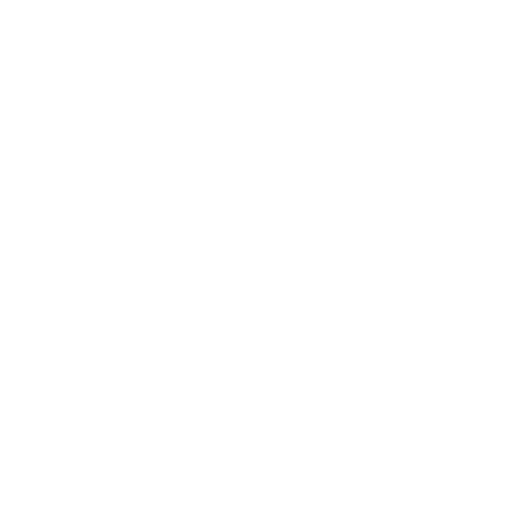

--!--

Le WebAssembly (wasm) est un bytecode executé dans une machine virtuelle, interpretable par des navigateurs web. Il permet d'exécuter un code performant, sécurisé et très bas niveau par rapport aux languages web habituels.

--!--

#### 1.1 Performance
* Le WebAssembly est un langage machine qui peut être executé directement depuis le navigateur</li>
* Bien que le JavaScript soit désormais également compilé par les navigateurs pour de meilleurs performances, le WebAssembly possède un avantage indéniable : la [Streaming compilation](https://react-etc.net/entry/webassembly-vs-javascript-streaming-compilation-performance-advantage)
  
--!--

### JavaScript

En JavaScript, chaque fichier contenant le code doit être totalement téléchargé par le client avant que celui-ci puisse commencer à le compiler en code natif. 

--!--

### WASM

En WebAssembly, le code est streamé vers l'utilisateur et la compilation en code natif démarre dès les premiers bits reçus. 

--!--
Cette différence de fonctionnement entre les deux langages donne un avantage certain au wasm en terme de temps de démarrage, notamment lorsque la connexion est moins bonne (sur les appareils mobiles par exemple).

--!--

Le WebAssembly compilé donné également de meilleurs résultats que le JavaScript compilé, notamment sur mobile : [Voir ce benchmark](https://medium.com/@torch2424/webassembly-is-fast-a-real-world-benchmark-of-webassembly-vs-es6-d85a23f8e193?p=783c454449cd)

Le gain en vitesse de chargement est de l'ordre de 30% **minimum**.
<!-- .element class="fragment"-->

--!--

